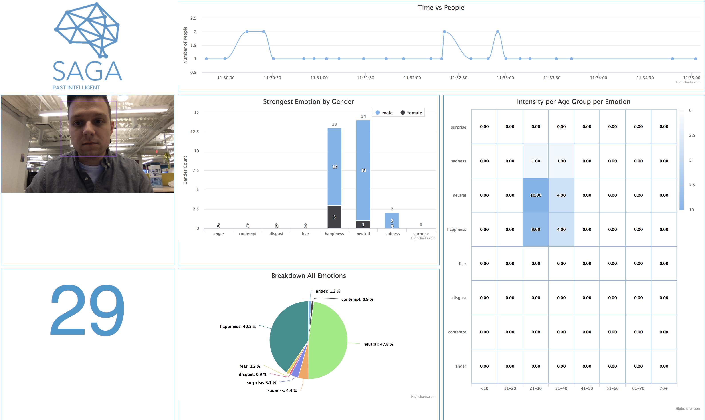

# 
This project was created as part of SAP Analytic Cloud's December 2017 hack day. The motivation behind it was to branch outside of our day to day development tools, frameworks, and infrastructure to try something new. We a general analytic theme we decided to take on visual recognition and decided that the facial recognition and emotion analysis from the Azure Cognitive services was a prime resource we could leverage.

The visualizations from top to bottom, left to right:

- Time vs people shows the flow of people past your input source
- Webcam image shows a sample and detection boxes
- Strongest emotion grabs the dominenant emotion and examines it as emotion vs gender
- Intensity per Age Group per Emotion shows the aggregations of users per emotion and age group
- The unnamed number is the count of unique passerbys
- Breakdown All Emotions shows all of the emotions aggregated per person including emotions that aren't considered dominant



# Usage
## Initial Setup
```
npm install -g webpack
npm install
```

## Running
```
npm run watch
npm run start
```

# The Team

From left to right:
Daisy Tse, Asif Mammadov, Jeff Lee, Wenguang Xu, Jonathan Friesen, Albert Guo